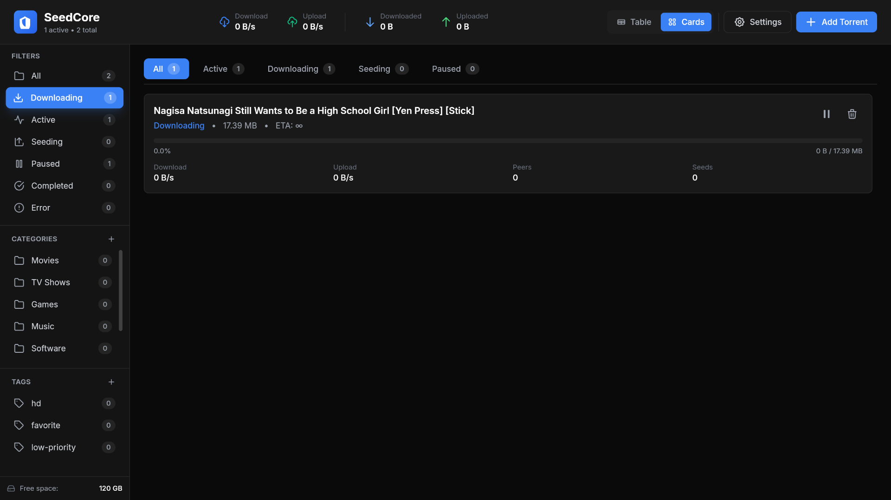
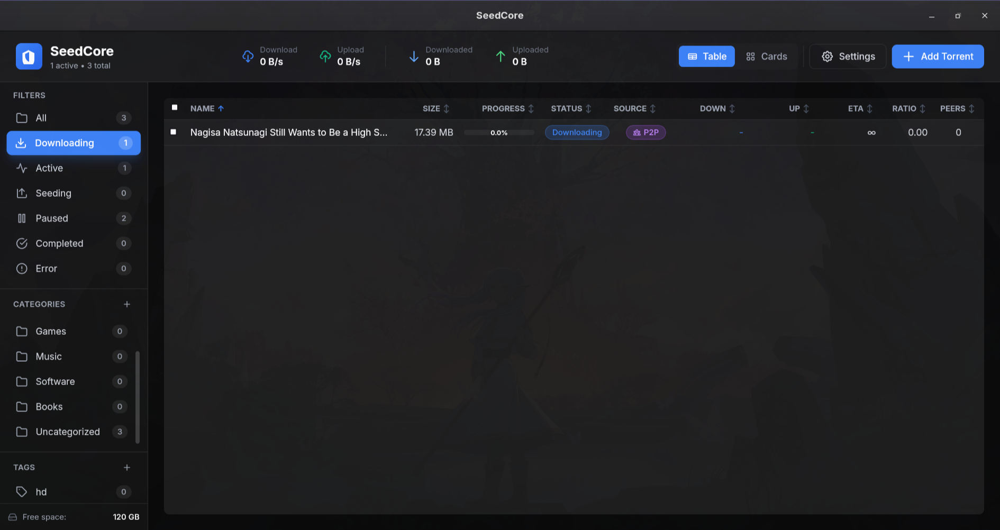
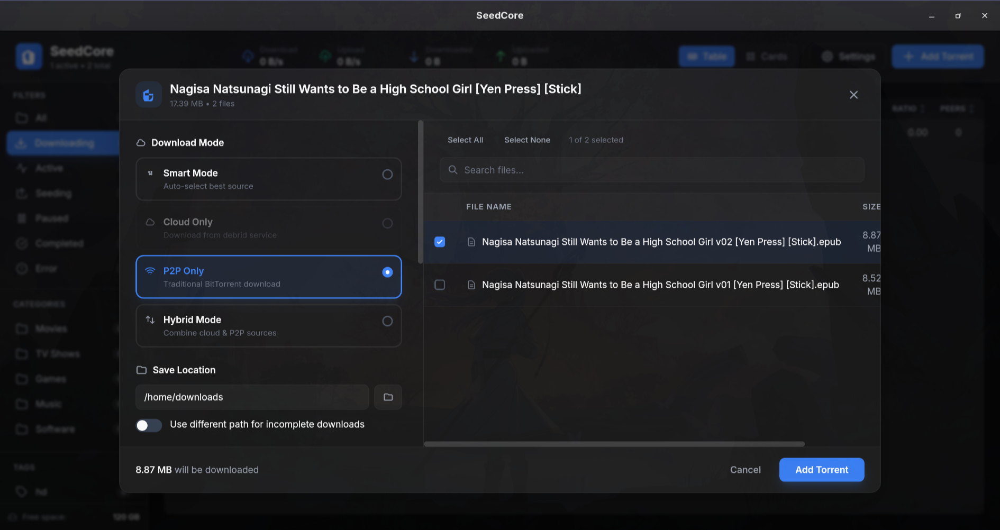

# SeedCore 🌱

**A modern BitTorrent client with cloud debrid integration**

SeedCore is a lightweight, fast BitTorrent client that supports both traditional torrenting and cloud-based downloading through Real-Debrid and Torbox services.

---

## ✨ Features

- **Traditional Torrenting**: Download torrents directly using the BitTorrent protocol
- **Cloud Downloads**: Instantly download cached torrents through Real-Debrid or Torbox
- **Hybrid Mode**: Automatically switch between cloud and traditional downloading
- **Smart Mode**: Intelligently choose the best download method
- **Real-time Progress**: Track download progress for individual files
- **Beautiful Interface**: Modern, clean UI with dark theme

---

## 🚀 Getting Started

### Prerequisites

- **Windows**, **macOS**, or **Linux**
- **Real-Debrid** or **Torbox** account (optional, for cloud downloads)

### Installation

1. Download the latest release for your platform
2. Install and launch SeedCore
3. (Optional) Configure your debrid service credentials

---

## 📖 How to Use

### 1. Setting Up Master Password

When you first open SeedCore, you'll need to set a **master password** to encrypt your API keys securely.

1. Go to **Settings** (gear icon in the sidebar)
2. Enter a strong master password
3. Confirm the password
4. Click **Set Master Password**

**Important**: Remember this password! It's used to encrypt your debrid service API keys.

---

### 2. Configuring Debrid Services (Optional)

To use cloud downloads, you need to add your Real-Debrid or Torbox API key.

#### Getting Your API Key

**For Real-Debrid:**

1. Log in to [real-debrid.com](https://real-debrid.com)
2. Go to Account Settings → API
3. Copy your API token

**For Torbox:**

1. Log in to [torbox.app](https://torbox.app)
2. Go to Settings → API
3. Copy your API key

#### Adding API Key to SeedCore

1. Go to **Settings** → **Debrid**
2. Unlock with your master password
3. Paste your API key in the **Torbox** or **Real-Debrid** field
4. Click **Save**
5. Wait for validation (you should see a success message)

---

### 3. Adding a Torrent

Click the **+** button in the toolbar to add a torrent.

#### Download Modes

**Local Mode**

- Downloads using traditional BitTorrent protocol
- Connects to peers and downloads pieces
- Best for torrents with many seeders

**Cloud Mode**

- Downloads through your debrid service (Real-Debrid/Torbox)
- Instant download if torrent is cached
- Super fast speeds (limited by your internet, not seeders)
- Requires a debrid subscription

**Smart Mode**

- Automatically chooses the best method
- Checks if torrent is cached on debrid
- Falls back to local if not cached

**Hybrid Mode**

- Tries cloud download first
- Switches to local if cloud fails
- Best of both worlds

#### Adding a Torrent File

1. Click **Browse** to select a .torrent file
2. Choose your **download mode**
3. Select **save location**
4. Pick a **category** (optional)
5. Click **Add Torrent**

#### Adding a Magnet Link

1. Paste the magnet link in the text field
2. Choose your **download mode**
3. If cloud/smart/hybrid mode is selected and multiple debrid services have the torrent cached, select your preferred provider
4. Select **save location**
5. Click **Add Torrent**

---

### 4. Monitoring Downloads

The main interface shows all your torrents with:

- **Name** and **Size**
- **Download/Upload speed**
- **Progress bar**
- **Status** (Downloading, Seeding, Paused, etc.)
- **ETA** (estimated time remaining)

#### Per-File Progress

Click on a torrent to see detailed file-by-file progress.

For cloud downloads, you'll see:

- **Individual file progress**
- **Download speed** per file
- **Status badges** (Queued, Downloading, Complete, Error)

---

## 🔧 How It Works

### Traditional Torrenting

1. **Parse torrent file** to get tracker and file information
2. **Contact tracker** to get list of peers
3. **Connect to peers** via BitTorrent protocol
4. **Download pieces** from multiple peers simultaneously
5. **Verify pieces** using SHA1 hashes
6. **Save to disk** as pieces are verified

### Cloud Downloads (Debrid)

1. **Send magnet/torrent** to your debrid service
2. **Debrid service checks** if torrent is already cached
3. **If cached**: Instantly get download links
4. **If not cached**: Debrid downloads it to their servers (fast servers, many peers)
5. **Download files** directly from debrid's CDN via HTTPS
6. **Track progress** per file with real-time speed

**Why use debrid services?**

- Instant downloads for popular torrents (already cached)
- Extremely fast speeds (CDN delivery, not limited by seeders)
- No need to seed (debrid handles it)
- Privacy (your IP doesn't connect to the swarm)
- Download from multiple hosters (not just torrents)

---

## 🎯 Tips & Tricks

**Cloud Downloads**

- Most popular torrents are already cached on debrid services
- Cloud downloads are much faster than traditional torrenting
- Perfect for movies, TV shows, and popular software

**Traditional Downloads**

- Better for niche/rare torrents that aren't cached
- Helps the BitTorrent ecosystem by seeding
- No subscription required

**Smart Mode**

- Best option if you have a debrid subscription
- Automatically uses the fastest method
- No need to manually check if cached

**Hybrid Mode**

- Ultimate fallback strategy
- Always gets your download, one way or another

---

## ❓ Troubleshooting

### "Failed to save credentials"

**Solution:**

1. Make sure you unlocked with your master password first
2. Check that your API key is correct (no extra spaces)
3. Verify your internet connection
4. Try re-entering the API key

### Cloud downloads stuck at 0%

**Possible causes:**

- Torrent is not cached on debrid service (wait a few minutes)
- Invalid API key (re-enter credentials)
- Debrid service is down (check their status page)
- File selection required (SeedCore handles this automatically, but may take time)

**Solution:**

- Wait 1-2 minutes for debrid to process the torrent
- Check browser console (F12) and app logs for errors
- Try switching to another debrid provider

### Master password forgotten

**Unfortunately:** There's no way to recover API keys without the master password (they're encrypted)

**Solution:**

1. Delete the app data folder:
   - **Linux**: `~/.config/seedcore/`
   - **macOS**: `~/Library/Application Support/seedcore/`
   - **Windows**: `%APPDATA%\seedcore\`
2. Restart SeedCore
3. Set a new master password
4. Re-enter your API keys

---

## 🔒 Privacy & Security

- **Master password** encrypts all API keys using AES-256-GCM
- **API keys** are never stored in plain text
- **Local torrents** connect directly to peers (your IP is visible to the swarm)
- **Cloud torrents** use HTTPS and hide your IP from the torrent swarm

---

## 🐛 Reporting Issues

Found a bug? Have a feature request?

1. Check if it's already reported in [Issues](../../issues)
2. Create a new issue with:
   - Description of the problem
   - Steps to reproduce
   - Screenshots (if applicable)
   - Operating system and version

---

## 📜 License

MIT License - Free to use, modify, and distribute

---

## 🙏 Credits

**Built with:**

- [Tauri](https://tauri.app/) - Lightweight desktop framework
- [Rust](https://www.rust-lang.org/) - Systems programming language
- [React](https://react.dev/) - UI framework

**Supported Services:**

- [Real-Debrid](https://real-debrid.com)
- [Torbox](https://torbox.app)

---

**Enjoy downloading!** 🚀
